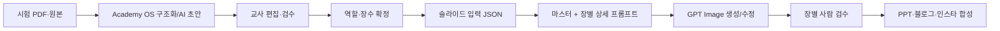

# Academy OS 시험분석 슬라이드 상세 프롬프트 규칙 Gate 6

## 최종 목표

Academy OS가 시험 PDF/웹 분석을 끝내면 검수된 데이터를 슬라이드 입력 JSON으로 내보내고, 프롬프트 생성기가 다음 결과를 만든다.

```text
0. 모든 장 공통 마스터 프롬프트
1번 슬라이드 프롬프트 — 표지
2번 슬라이드 프롬프트 — 시험 구조
3번 슬라이드 프롬프트 — 총평
4번 슬라이드 프롬프트 — 주요문항 1
5번 슬라이드 프롬프트 — 풀이 1
...
각 장 검수 체크 + 부모 버전 기반 수정 프롬프트
```

사용자는 생성된 Markdown에서 각 블록을 복사해 GPT Image 대화에 붙이고, 학교별 데이터나 문구만 수정할 수 있다. ChatGPT 대화에서 이미지 생성을 요청하든 API로 호출하든 이미지 모델 자체보다 중요한 것은 같은 확정 입력·역할·스타일·자산 계약을 전달하는 것이다. 대화형 작업은 눈으로 보고 부분 수정하기 쉽고, API는 대량 자동화·버전 관리에 유리하다. 현재 Gate는 유료 호출을 자동화하지 않고 프롬프트 산출까지만 담당한다.

## 데이터 흐름



원본 우선순위는 `final_fields > teacher_fields/human_fields > ai_fields`다. 프롬프트 생성은 `status=human_confirmed`인 슬라이드만 허용한다. AI 재분석이나 템플릿 변경이 교사 확정 데이터, 장 순서, 자산 연결을 덮어쓰면 안 된다.

## Academy OS 입력 계약

예제: `docs/exam-analysis-prompt-input-example.json`

필수 프로젝트 필드:

- `schoolLevel`: `middle` 또는 `high`
- `schoolName`, `grade`, `examName`, `subject`
- `canvas`: 출력 비율과 크기
- `style`: 색상, 모티프, 장식 강도, 톤
- `brand`: 제공 로고 사용법, 푸터
- `slides[]`: 교사가 확정한 순서

예제 파일은 `exampleOnly=true`라 대괄호 자리표시자를 허용한다. 실제 입력에서는 이 값을 제거하거나 `false`로 두며, 생성기가 해결되지 않은 `[자리표시자]`를 발견하면 중단한다.

각 `slides[]` 필드:

- `id`: 저장과 수정 이력을 유지할 불변 ID
- `role`: Gate 5 역할 키
- `status`: 반드시 `human_confirmed`
- `data`: 그 장에서 사용할 확정 내용만 포함
- `sourceAssets[]`: 문제/풀이/표/교재 원본의 자산 ID와 crop 지시
- `composition`: 기본 역할 레이아웃을 바꿀 때만 선택 입력

## 장수·역할 추천 규칙

Academy OS는 Gate 4 패턴으로 초안을 만들되 자동 확정하지 않는다.

- 중학교 기본: M1 8~10장
- 고등학교 기본: H1 8~10장
- 교재 출처·원본 문제·손풀이가 2묶음 이상 확정: H2 12~14장
- 데이터가 부족한 압축형: 교사에게 누락 경고 후 M2
- 내부 비교표가 있음: M3 또는 별도 파생 산출물

조건부 역할은 데이터가 있을 때만 삽입한다. 빈 필드를 그럴듯한 문장으로 채우지 않는다. 주요문항과 풀이의 연결은 `questionId` 같은 내부 ID로 유지하고 위치만으로 추정하지 않는다.

## 프롬프트 3층 구조

### 1. 마스터 프롬프트

모든 장에 공통인 프로젝트 정체성, 색상 토큰, 비율, 브랜드, 전역 금지사항을 담는다. 학교마다 한 번만 만든다.

### 2. 역할 프롬프트

Gate 5의 목적·레이아웃·컴포넌트·자산 정책을 주입한다. 같은 역할은 학교가 바뀌어도 골격을 재사용한다.

### 3. 인스턴스 데이터

학교명, 문항 번호, 검수 문구, 원본 자산 ID처럼 이번 시험에만 해당하는 값을 넣는다. 이 층만 교체하면 같은 구조로 다른 학교 세트를 만든다.

## 이미지 생성과 합성 규칙

| 역할 | 권장 처리 |
|---|---|
| 표지·총평·다음 대비·CTA | GPT Image 생성 가능 |
| 시험 구조·난이도·주요문항 요약 | 배경/프레임 생성 + 정확한 텍스트 후편집 |
| 주요문항·풀이 | 프레임 생성 + 원본 문제/손풀이 합성 |
| 원본 문제·교재·표·단원 차트 | 원본 또는 코드 렌더, 이미지 모델 재생성 금지 |

GPT Image에 긴 한글과 수식을 완성본으로 맡기면 오탈자와 숫자 변형 위험이 있다. 따라서 프롬프트는 이미지 모델에게 “정확한 텍스트가 들어갈 구조”를 만들게 하고, 최종 콘텐츠는 편집 가능한 레이어로 합성하는 방식을 기본값으로 한다.

## 반복 수정 규칙

수정은 항상 부모 이미지/부모 프롬프트를 지정하고 `수정할 항목`과 `변경 금지 항목`을 함께 쓴다.

```text
이전 4번 슬라이드를 부모 버전으로 유지하고 강조색과 오답 포인트 문구만 수정하세요.
변경 금지: 캔버스, 제목 위치, 원본 문제 crop, 문항 번호, 개념 태그, 로고/푸터, 나머지 텍스트.
```

수정 결과는 새 버전으로 저장하고 부모를 덮어쓰지 않는다. 장별 `slideId`, `version`, `parentVersionId`, `prompt`, `assetIds`, `reviewStatus`를 남겨야 한다.

## 실행

```powershell
npm run generate:exam-slide-prompts -- docs/exam-analysis-prompt-input-example.json docs/exam-analysis-prompt-output-example.md
```

생성기는 역할 키, 필수 프로젝트 값, 중복 ID, `human_confirmed` 상태를 검사하고 Markdown을 만든다. 이미지 API는 호출하지 않는다.

## Academy OS 구현 시 저장 모델

향후 웹 OS에 연결할 때의 권장 레이어:

- `ai_fields`: 분석 AI 초안
- `localDraft`: 교사가 편집 중인 내용
- `teacher_fields`/`human_fields`: 저장된 교사 수정본
- `final_fields`: 역할·장수·데이터가 확정된 산출물 입력
- `slide_prompt_versions`: 장별 프롬프트와 부모 버전
- `slide_assets`: 원본 문제/풀이/표 crop 연결

프롬프트 생성 완료는 파일이 화면에 보이는 것만으로 판정하지 않는다. 확정 입력 저장 → 서버 재조회 → 같은 역할·순서·자산 ID 대조가 끝난 뒤에만 완료로 표시한다.

## 최종 검수 gate

1. 교사가 슬라이드 역할과 장수를 확정했는가.
2. 각 데이터가 AI 초안이 아니라 검수본인가.
3. 숫자·수식·문항·표는 원본/코드 레이어인가.
4. 1번부터 마지막 장까지 스타일 토큰이 같은가.
5. 수정 프롬프트가 지정하지 않은 요소를 보존하는가.
6. 완성된 각 장이 원본 분석 사실과 다시 대조되는가.

하나라도 아니면 이미지 생성 또는 다음 채널 산출물로 넘어가지 않는다.
